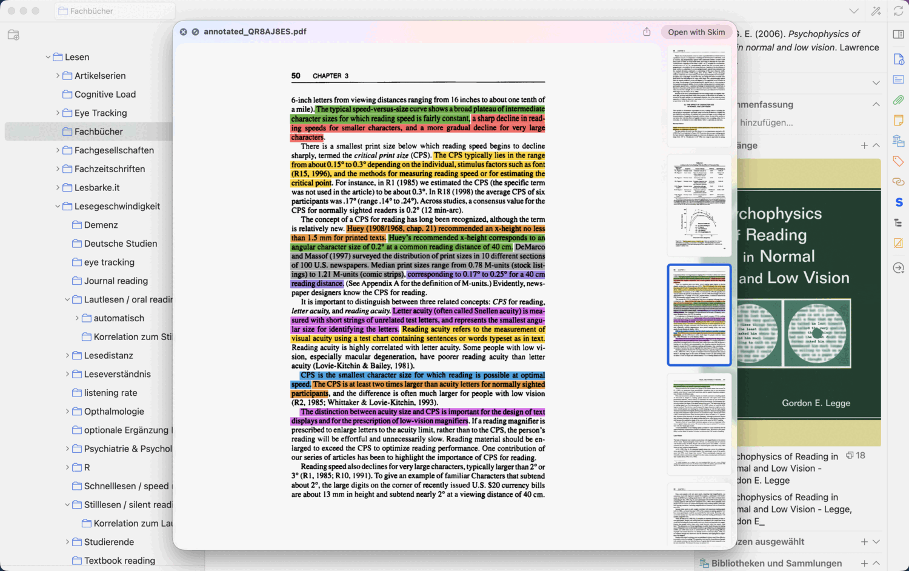
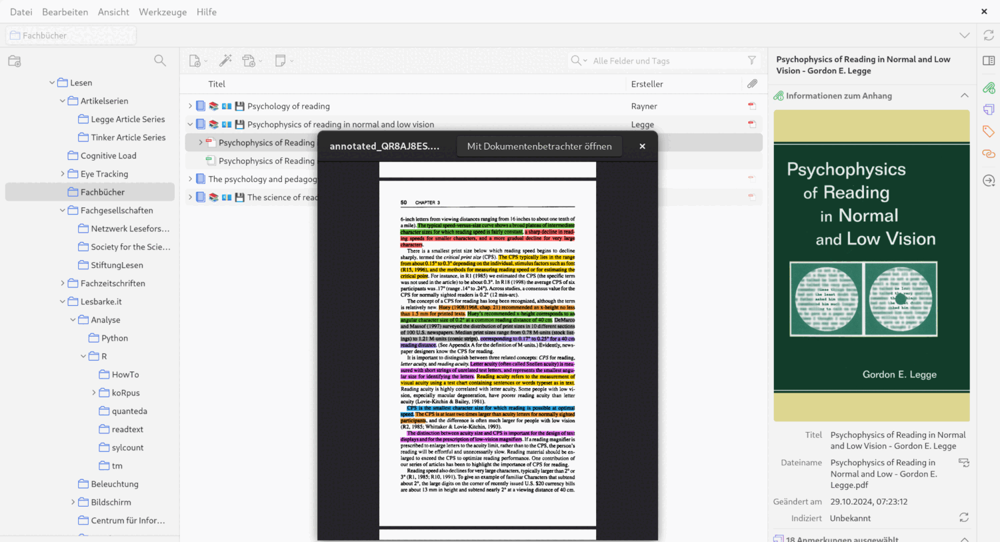
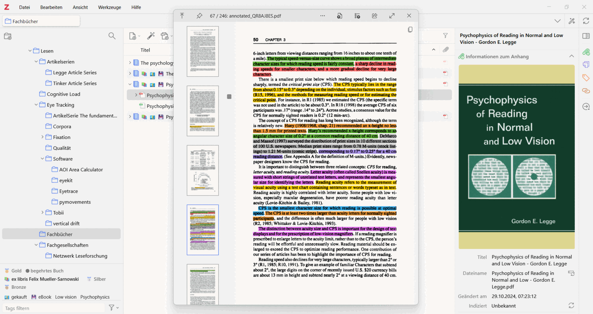
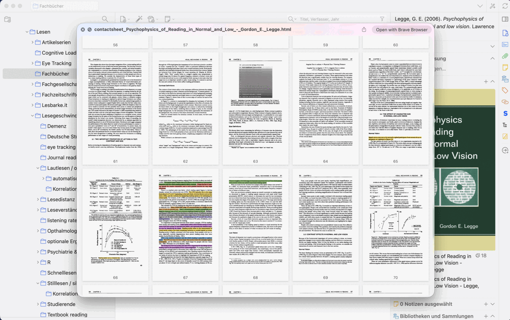
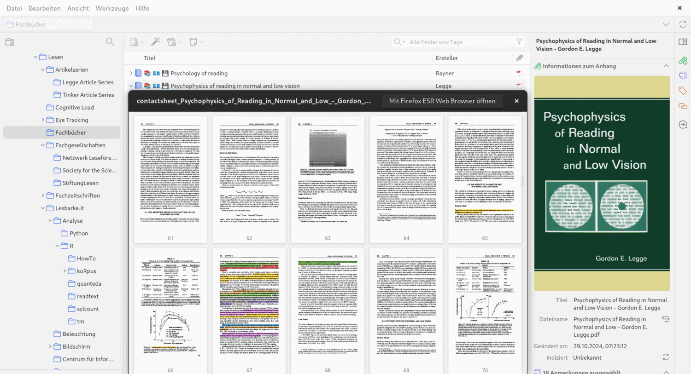
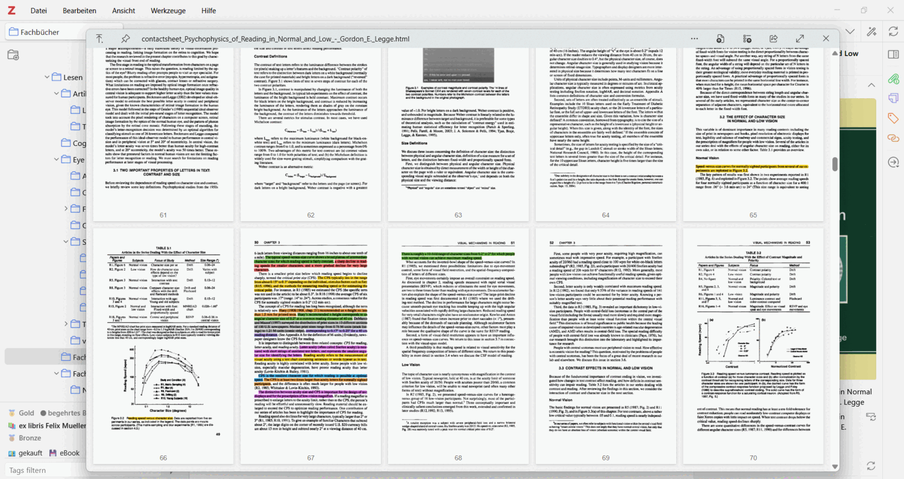
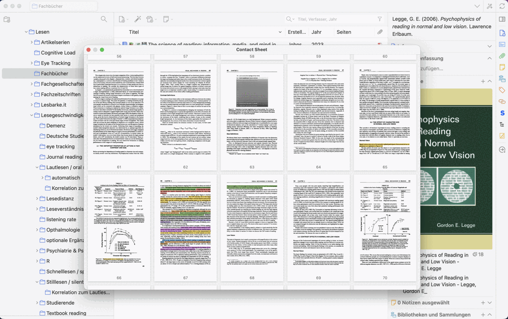
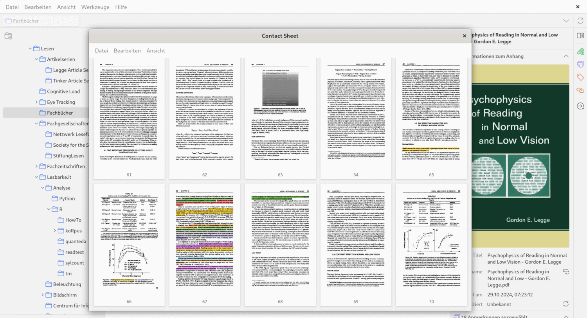
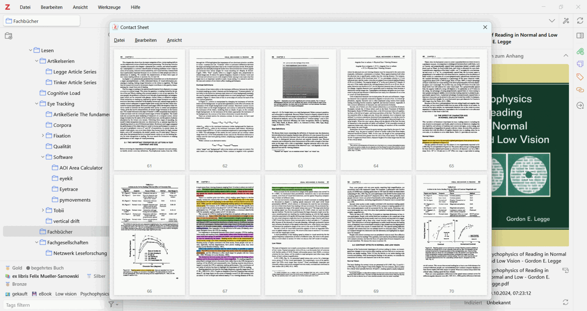

# zotLook


[](https://github.com/fre-ms/zotLook/actions/workflows/ci.yml)
[](https://www.zotero.org)

[](https://github.com/fre-ms/zotLook/releases)
[](https://github.com/fre-ms/zotLook/releases)
[](https://github.com/fre-ms/zotLook/releases/latest)
[](LICENSE)

A plugin for Zotero 10 — the version it is developed and tested against — that
previews attachments when you press **Space**, the way a file manager does. It carries no
viewer of its own, but drives the preview panel the system already has:

- [**Quick Look**](https://en.wikipedia.org/wiki/Quick_Look) on **macOS**,
- [**GNOME Sushi**](https://gitlab.gnome.org/GNOME/sushi) on **Linux** and
- [**QuickLook**](https://github.com/QL-Win/QuickLook) on **Windows**.

📖 **[Documentation — zotlook.org](https://zotlook.org)** ·
[Deutsche Fassung](https://zotlook.org/latest/de/)

## What it does

The same three keystrokes on all three systems, each driving the preview that
system already has. Click any image for the full-size version.

|  | **macOS** · Quick Look | **Linux** · GNOME Sushi | **Windows** · QuickLook |
|---|:---:|:---:|:---:|
| **Space**<br>preview the attachment | [](asset/screenshot/macos-preview.png) | [](asset/screenshot/linux-preview.png) | [](asset/screenshot/windows-preview.png) |
| **Ctrl+Shift+Space**<br>contact sheet | [](asset/screenshot/macos-contact-sheet.png) | [](asset/screenshot/linux-contact-sheet.png) | [](asset/screenshot/windows-contact-sheet.png) |
| **Ctrl+Alt+Space**<br>the same sheet in a Zotero window | [](asset/screenshot/macos-contact-sheet-window.png) | [](asset/screenshot/linux-contact-sheet-window.png) | [](asset/screenshot/windows-contact-sheet-window.png) |

The sheet in its Zotero window, on macOS, driven with the mouse: the contents
from the PDF's outline, the annotations from Zotero, each entry bringing its
page to the middle of the sheet; a search for a word, dimming the pages
without it; and a click on a page handing over to the reader. The [full
screencast](asset/screenshot/macos-en-screencast.mp4) goes on to do the same
with the keyboard alone.


**Shift+Space** previews the item's notes.

- Anything the system's preview panel can show, plus **EPUB**, which zotLook
  renders itself because no system preview does.
- **Your annotations are in the preview** — in a PDF and in an EPUB alike.
  Zotero keeps them in its database rather than in the file, so a preview of
  the stored document would otherwise be unmarked. An EPUB is marked where you
  marked it: zotLook resolves the EPUB CFI Zotero stored, and draws highlights
  and underlines the way Zotero's own reader draws them.
- **An EPUB carries its contents and its annotations** behind a button in each
  corner, opening over the page. Clicking an annotation takes you to the
  passage. No script is involved, which is what lets it work in a preview panel
  that runs none.
- **Clicking a page of the contact sheet** opens it in Zotero's reader at that
  page. A button in each corner opens the document's contents and its
  annotations, each entry a jump to its page.
- **A book gets a page overview too**, where it can have one. A reflowable EPUB
  has no pages of its own, but one published beside a print edition usually
  carries that edition's pagination along with it — and zotLook cuts the book
  at those marks, one tile per printed page, each linking back into the reader.
  A book carrying none says so rather than showing arbitrary slices.
- **Previews are kept and shown again**, across restarts, until the file, its
  annotations or the settings behind them change. What they occupy is shown in
  the settings, where they can also be cleared.
- Synced files that are not downloaded locally are fetched first.
- Shortcuts, which attachment wins, the grid and the page limit are all
  configurable under **Settings → zotLook**. English and German.

## Requirements

- **Zotero 10** — the version zotLook is developed and tested against
- **macOS 12** or later — nothing else to install
- or **Linux** with GNOME Sushi (`apt install gnome-sushi`)
- or **Windows** with [QuickLook](https://github.com/QL-Win/QuickLook) running

### Older versions of Zotero

zotLook still **installs** on Zotero 7 and later, and may well work there, but it
has been neither developed nor tested on 7, 8 or 9, so nothing about them is
claimed. Reading Zotero's own sources says this much:

- Everything else the plugin calls is there in **7.0.0** already —
  `zotero://open-pdf?cfi=`, `PreferencePanes.register`, `PDFWorker.export`,
  `getMainWindows`.
- `EPUB.mjs`, which the EPUB preview and the EPUB page overview are built on,
  first appears in **Zotero 8**. Below that, everything to do with EPUB cannot
  work.
- Whether Zotero 7 keeps its bundled pdf.js where the contact sheet looks for it,
  I could not check.

If you run zotLook on an older Zotero — successfully or not — please
[say so](https://github.com/fre-ms/zotLook/issues). Reports are welcome and will
be reflected here.

## Install

Download the latest `.xpi` from
[Releases](https://github.com/fre-ms/zotLook/releases), then in Zotero:
**Tools → Add-ons →** gear icon **→ Install Add-on From File…**

Zotero checks this repository for new versions and updates the plugin itself
from then on.

## Build

```bash
./build.sh                  # a release build needs macOS with the Xcode CLT
npm install && npm test
```

The build script also runs on Linux, where there is no Swift toolchain for the
Quick Look helper; it then packages everything else and leaves `update.json`
alone.

How all of it works — driving each system's preview, the EPUB conversion, the
contact sheet renderer, the test suite and the release process — is in the
[developer guide](https://zotlook.org/latest/en/dev/architecture.html).

## Something not working?

[When something goes wrong](https://zotlook.org/latest/en/trouble.html) says
what to check first and where zotLook writes down why a preview failed — a file
worth attaching to a report. Bugs and requests:
[issues](https://github.com/fre-ms/zotLook/issues).

## Provenance

**zotLook is a fork of
[gchapron/Zotero7QuickLook](https://github.com/gchapron/Zotero7QuickLook) by
Guillaume Chapron**, from whom the code and the MIT licence come. Roughly half
of his JavaScript survives verbatim, and the architecture is his throughout.

Further back stands
[mronkko/ZoteroQuickLook](https://github.com/mronkko/ZoteroQuickLook) by Mikko
Rönkkö, which brought Quick Look to Zotero 4–6 and gave this line of plugins its
purpose and its name. **The debt to it is one of idea, not of code** — of 206
substantive lines in the original, exactly one also appears here, and it is a
Zotero API call any such plugin must write.

The full accounting, with the measurements behind those numbers, is under
[Origins](https://zotlook.org/latest/en/origins.html).

The plugin ID is `zotlook@fre.ms`, distinct from Chapron's, so the two install
side by side rather than over one another.

## Licence

MIT — see [LICENSE](LICENSE).
