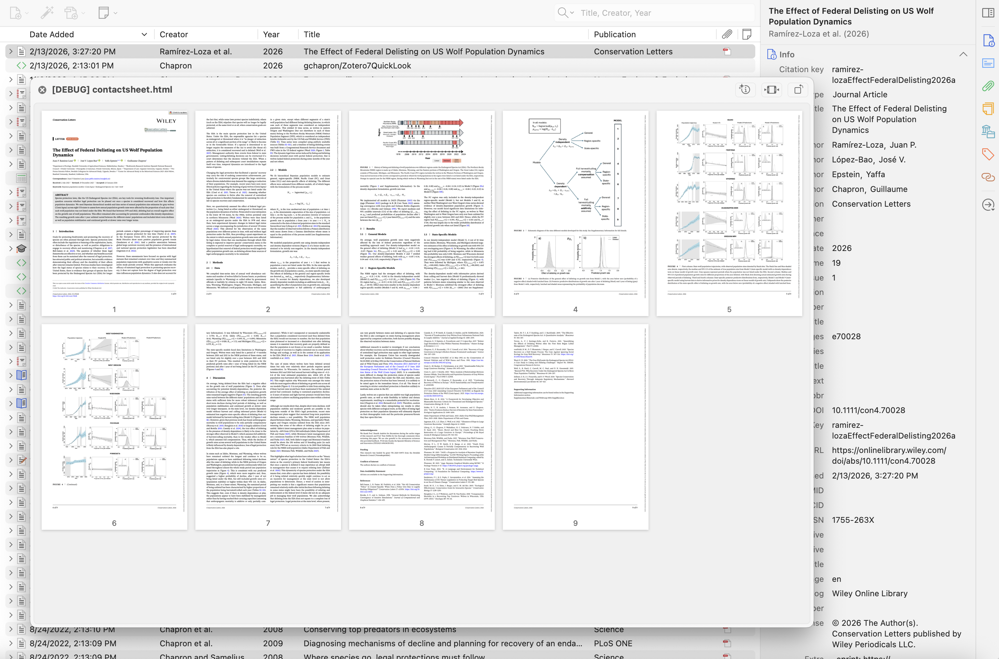

# zotLook

[](https://github.com/fre-ms/zotLook/actions/workflows/ci.yml)

A plugin for Zotero 7 and later (tested on 7, 8, 9, and 10) that lets you preview attachments by pressing **Space**, the way a file manager does. It drives the system's own preview panel: Quick Look on macOS, GNOME Sushi on Linux, [QuickLook](https://github.com/QL-Win/QuickLook) on Windows.

### Provenance

**zotLook is a fork of [gchapron/Zotero7QuickLook](https://github.com/gchapron/Zotero7QuickLook) by Guillaume Chapron**, from whom the code and the MIT licence come. It is maintained and developed further here by [fre-ms](https://github.com/fre-ms).

A good deal of Chapron's work is still in place. Measured against the last upstream commit, counting only lines that are neither blank, a comment nor a brace: **49 %** of the JavaScript and **52 %** of `bootstrap.js` survive verbatim, and 20 of the original 28 methods are still present under their own names. The architecture is his throughout — the bootstrap-plus-singleton shape, the capture-phase key listener on the items tree that gets in front of Zotero's own Space handler, holding the preview subprocess open so a second press dismisses it, the temp-directory strategy, resolving a synced attachment before previewing it, and the ideas behind both the EPUB-to-HTML conversion and the contact sheet.

Further back stands [mronkko/ZoteroQuickLook](https://github.com/mronkko/ZoteroQuickLook) by Mikko Rönkkö, which brought Quick Look to Zotero 4–6 and gave this line of plugins its purpose and its name. **The debt to it is one of idea, not of code.** That plugin was a XUL overlay extension — `install.rdf`, `overlay.xul`, a Windows `Bridge.exe`, an AppleScript and a Perl script — an architecture Zotero 7 abolished outright, so Chapron wrote a new plugin rather than porting the old one. Comparing the two directly bears that out: of 206 substantive lines in the original, exactly one also appears here, and it is the Zotero API call `Zotero.Sync.Runner.downloadFile(item)`, which any plugin fetching a synced attachment must write. Everything else the two share is Zotero and DOM API names. Rönkkö is therefore credited here as the originator of the idea, and is deliberately not listed as an author of this code — the repository carries no licence, and none was needed, because nothing was taken from it.

The plugin ID is `zotlook@fre.ms`, distinct from Chapron's, so the two install side by side rather than over one another.



## Features

- **Space** — Toggle QuickLook preview on the selected item (prefers PDF, then EPUB, over other attachments)
- **Shift+Space** — Preview the notes attached to the selected item
- **Ctrl+Shift+Space** — Preview a PDF as a contact sheet (grid of page thumbnails, adaptive layout for few-page PDFs); clicking a page opens it in Zotero's reader
- **Escape** — Close the preview
- **Right-click → Quick Look** — Context menu entry
- **Right-click → Quick Look Contact Sheet** — Context menu entry, shown only when the selection actually contains a PDF
- **Shift+Alt+Space** (Option on macOS) — the same sheet in a Zotero window, which stays open beside the reader (also in the context menu)
- Works with PDFs, images, HTML, EPUBs, and any file type the system's preview panel supports
- Selecting a parent item previews one of its attachments; which one is configurable under **Settings → zotLook** — either by a reorderable type ranking (PDF, EPUB, HTML, image, video, anything else) or simply the first attachment the item lists
- EPUB files are rendered on the fly into a single styled HTML page (Palatino, 80 px margin, book-width column), with the book's own stylesheets loaded so layout and typography are preserved — switchable off under **Settings → zotLook** if a Quick Look extension handles EPUB better
- Notes are rendered as HTML and previewed
- PDF annotations made in Zotero are drawn into the preview and into the contact sheet — Zotero keeps them in its database, not in the file, so the stored PDF is unmarked
- Synced files that aren't downloaded locally are fetched automatically
- Menu and progress text are localised (English and German)
- Shortcuts and the contact sheet page limit are configurable under **Settings → zotLook**, with a check against Zotero's own shortcuts

## Requirements

- **macOS**, which drives the native Quick Look panel, **Linux with GNOME Sushi** installed, or **Windows with [QuickLook](https://github.com/QL-Win/QuickLook)** running — its Microsoft Store build and its desktop build answer alike
- **Zotero 7** or later
- **macOS 12 (Monterey)** or later for Quick Look itself; the contact sheet is built on every platform

## Installation

1. Download the latest `.xpi` file from the [Releases](https://github.com/fre-ms/zotLook/releases) page
2. In Zotero, go to **Tools → Add-ons**
3. Click the gear icon → **Install Add-on From File...**
4. Select the downloaded `.xpi` file
5. Restart Zotero

Once installed, Zotero checks this repository for new versions and updates the plugin itself.

## Building from source

A release build requires macOS with the Xcode Command Line Tools, which is what compiles the Quick Look helper. That helper is the only compiled piece: the Windows route drives QuickLook's pipe through js-ctypes and ships no binary of its own.

```bash
git clone https://github.com/fre-ms/zotLook.git
cd zotLook
./build.sh
```

`build.sh` compiles the helper binary (`qlpreview`) for both architectures, signs them (`swiftc` ad-hoc signs the arm64 slice but not the x86_64 one, and `lipo` does not sign the container, so without this the result reports as unsigned), packages the `.xpi`, and rewrites `update.json` to match — version, download URL and SHA-256 all derived from the manifest and the file that was just built.

The same script also runs on Linux, where there is no Swift toolchain to compile that helper with. It then packages everything else, which is all the Linux route needs, and leaves `update.json` alone: a package without the helper is fine to install and test locally, but publishing its checksum would auto-update macOS copies to a build that has lost their Quick Look panel.

The resulting `build/zotlook-<version>.xpi` can be installed in Zotero as described above.

### Repository layout

```
addon/     copied verbatim into the XPI; this is the plugin as Zotero sees it
native/    Swift helpers, compiled by build.sh rather than shipped
asset/     images used by this README
doc/       documentation
test/      test suite (see below)
build/     the packaged .xpi; git-ignored
```

Zotero requires `manifest.json`, `bootstrap.js` and `locale/` at the root of the
XPI, which is why `addon/` is packaged from its inside rather than as a folder.

`update.json` stays at the repository root rather than moving to `build/`: it is
not a build artefact but a published file, and its URL on `main` is what
installed copies poll.

Directory names are singular throughout. Worth knowing before publishing the
documentation: GitHub Pages, when deploying from a branch, accepts only `/` or
`/docs` as its source folder, so serving `doc/` that way needs a GitHub Actions
workflow instead.

### Tests

```bash
npm install   # linkedom, to stand in for Gecko's DOM, and eslint
npm test      # lints first, then runs the suites
```

The lint step is not decoration: a lost function parameter leaves an identifier
that still parses but throws at runtime, which `node --check` cannot see and
which every suite missed for as long as the function around it was stubbed.

CI runs both on every push and pull request. The suites run on Linux, where
they are platform-independent; the release build runs on macOS, because
`swiftc`, `lipo` and `codesign` live only there, and it checks that the XPI
holds every file Zotero needs at its root and that both helper binaries are
universal and signed. The suites run a second time on that job, where a freshly
built XPI is present, so the check that `update.json` describes the file that
was actually produced also runs.

The XPI is not byte-reproducible — zip records modification times — so CI does
not compare its checksum against the committed `update.json`. What it does
compare is the version, which is what actually goes stale.

The suite runs the plugin's own source in a scope with Zotero's sandbox globals
stubbed, so the parsing, sanitising, keyboard, menu and EPUB code can be
exercised without launching Zotero. It also checks that `update.json` agrees
with the manifest and that both locale bundles define exactly the strings the
code asks for — the mismatches that otherwise fail silently.

The plugin itself has no runtime dependencies; `linkedom` is a development
dependency only and is never packaged.

## Releasing

1. Bump `version` in `manifest.json`
2. `./build.sh`
3. Commit the regenerated `update.json`
4. `gh release create v<version> build/zotlook-<version>.xpi`

`update.json` must be committed to `main`, because that is the URL installed copies poll. Its update entry deliberately carries no `strict_max_version`: Zotero then treats the release as compatible with any version and can raise the ceiling on an already-installed copy, which is how compatibility with a future Zotero can be granted without shipping a new build. The `strict_max_version` in `manifest.json` still decides which Zotero will load the plugin at all.

## How it works

The code is split into three scripts, loaded in that order into the plugin scope: `util.js` (parsing, sanitising and URL helpers), `sheet.js` (the contact sheet's markup and sizing), `epub.js` (the EPUB-to-HTML pipeline) and `zotlook.js` (windows, shortcuts, subprocesses, notes and contact sheets). The page renderer runs apart from all of them, in `render.worker.js`. Strings live in `locale/<locale>/zotlook.ftl`.

Context menu entries are inserted into each window directly rather than through `Zotero.MenuManager`. That API accepts only an l10n id and never a plain label, so an entry whose string the preferences-independent Fluent context of the main window cannot resolve renders as an empty line; inserting the entries here keeps the label — and its English fallback — under the plugin's control.

Space is ignored while the item list is collecting a find-as-you-type search, so typing a title containing spaces still searches rather than opening a preview.

The plugin registers a keyboard listener on Zotero's items tree. When you press Space, it resolves the file path of the selected item's attachment and launches a small bundled helper, `qlpreview`, which drives `QLPreviewPanel` — the very panel the Finder shows. The subprocess handle is retained so that pressing Space again (or Escape) closes the preview.

On Linux the equivalent is GNOME Sushi, reached over D-Bus:

```
dbus-send --session --print-reply --reply-timeout=10000 \
  --dest=org.gnome.NautilusPreviewer \
  /org/gnome/NautilusPreviewer org.gnome.NautilusPreviewer.ShowFile \
  string:file:///path int32:0 boolean:true
```

`--print-reply` is not there for its output, and leaving it off is not a small difference: without it `dbus-send` writes the message and exits within milliseconds. Sushi is started by D-Bus on demand and takes about a second to come up, and `dbus-daemon` discards a message queued for an activation as soon as the connection that sent it goes away. The service then starts, is never told what to show, and quits again on its twelve-second idle timeout. Nothing appears and nothing is logged — the failure is completely silent, which is what made it worth a paragraph here. Waiting for the reply keeps the connection open until the call has been delivered.

The reply is also the only sign the plugin gets that the preview service answered at all, so the exit status is checked and a refusal — Sushi not installed, most likely — is named in the log rather than swallowed.

The call still returns as soon as the window has been handed its file, rather than staying alive for as long as the preview, so there is no process to hold and kill. `ShowFile`'s last argument closes the preview when the same file is already showing, which gives Space the same toggle it has on macOS. Sushi shows one file at a time. KDE has no comparable system-wide preview service — Kiview is a Dolphin extension without an external interface — so nothing is driven there.

On Windows the plugin drives [QuickLook](https://github.com/QL-Win/QuickLook), which listens on a named pipe, `QuickLook.App.Pipe.<user SID>`. One UTF-8 line through it —

```
QuickLook.App.PipeMessages.Toggle|C:\path\file.pdf|
```

— shows the preview, the same line again dismisses it, and a different path switches to that file, so Space has its toggle here too, again with no process to hold. The line is written straight from the plugin through js-ctypes — a handful of Win32 calls, no helper binary, no subprocess — with the SID read from the process token. Should Gecko ever drop ctypes, a PowerShell one-liner does the same write; it reaches the shell as `-EncodedCommand`, so no execution policy and no command-line quoting apply to it. An earlier attempt at this integration ([QuickLook #584](https://github.com/QL-Win/QuickLook/issues/584), 2019) foundered on exactly that SID, and this README long repeated its era's conclusion that the Store build was sandboxed away from the pipe. Measured today, neither holds: the Store package declares `runFullTrust` and answers the pipe like the desktop build, and the preview opens without taking focus from Zotero, so the keyboard keeps working where you are.

The pipe server earns one warning. Its reader takes a line per connection and dereferences whatever it got, so a client that connects and sends nothing — a `Test-Path` on the pipe path, any is-it-there probe — kills the listener with it, silently, until QuickLook is restarted. The plugin therefore never probes: every connection it makes carries one complete line, and "QuickLook is not running" is learned from the connect failing, which is when it is named in the log. What QuickLook can show still depends on its own viewers — PDF, images, video and HTML are built in; EPUB is not, which is what the plugin's EPUB conversion is for on Windows too. That conversion unpacks the book with `tar.exe`, the bsdtar Windows has shipped since Windows 10, because `/usr/bin/unzip` is a macOS and Linux address.

The contact sheet is built on every platform and shown on every platform. Enabling that on Windows waited for a measurement: QuickLook's HTML viewer does render the sheet's page and does load the thumbnail files sitting beside it.

The obvious alternative on macOS, `/usr/bin/qlmanage -p`, is a debugging tool rather than the Finder's Quick Look, and it cannot show everything the Finder can. On a video it dies outright:

```
NSInternalInconsistencyException
'Setting highlightedTimeRanges is not supported in your app.'
AVKitCore  -[AVPlayerItem setHighlightedTimeRanges:]
Movie      (/System/Library/QuickLook/Movie.qlgenerator)
```

Apple's own movie generator calls an AVKit method that AVKit refuses inside `qlmanage`. Driving `QLPreviewPanel` instead renders whatever the Finder renders, third-party Quick Look extensions included. `qlmanage` is kept only as a fallback for the case where the helper cannot be deployed.

EPUB previews are produced on the fly because no system preview renders an EPUB on its own. This is the one format the plugin transforms rather than handing over; everything else — MOBI, DJVU, whatever a preview extension claims — goes to the panel untouched. Because the plugin cannot reliably tell whether an EPUB extension is installed, the conversion is a setting rather than a guess: turn it off and the book goes to the panel like any other file. The plugin unzips the archive into a temp directory, parses `META-INF/container.xml` and the OPF package document, and walks the spine in reading order, appending each chapter's `<body>` into a single output document. The book's own stylesheets (linked and inline) are pulled in so the original layout is preserved, with a Palatino base font, 80 px margin, and 720 px book-width column applied on top. Relative URLs in markup and CSS are rewritten to absolute `file://` paths so images, fonts, and inline SVGs resolve. Parsing and assembly go through `DOMParser` and run on the document tree, so scripts and inline event handlers are removed as nodes rather than matched as text. A converted book is cached and reused until its file changes.

The contact sheet (Ctrl+Shift+Space) renders PDF pages as thumbnails into a scrollable HTML grid, which is then previewed via QuickLook. Rendering runs in ChromeWorkers against the pdf.js build Zotero already ships — four of them at most, fewer when the document is large enough that four copies of it are not worth the memory, and never more than there are cores. Pages are dealt round-robin rather than in blocks, because a document's heavy pages sit together and a block split would hand one worker all of them. The layout adapts to the number of pages: PDFs with few pages (1–4) use fewer columns and higher-resolution thumbnails so they fill the preview width instead of leaving empty space.

There was a second renderer, a bundled Swift binary using PDFKit, and it was about four times faster: 0.12 s against 0.42 s over 30 pages. It was dropped anyway. It only ever ran on macOS, so its annotation drawing was a second implementation that had to be kept looking like the first, and reaching it meant a subprocess, a JSON manifest and a pipe to read — machinery that produced two silent failures in an afternoon and exists for nothing else. Measured against it, Poppler's `pdftoppm` was only a third faster per thread than pdf.js and could not be bundled at all. What is left renders identically everywhere, and identically to Zotero's own reader, since it is the same engine.

Thumbnails are written as JPEG files into a directory beside the HTML and referenced with `loading="lazy"`, so the document stays small and images are decoded only as they scroll into view. Pages render concurrently — `CGPDFDocument` is not thread-safe, so each worker opens its own handle to the same file. Together these took a 300-page book from 44 seconds and a 111 MB document to about 7 seconds and 38 KB of HTML.

There is therefore no page limit by default. One can be set under **Settings → zotLook** for unusually large scans, to cap how long generation may take and how much temporary disk space it may use; when it bites, the sheet says how many pages it is showing. The column count is configurable in the same place, and the renderer raises the per-thumbnail resolution as columns are removed.

Each thumbnail is wrapped in a link to `zotero://open-pdf/…?page=N`, so clicking a page opens it in Zotero's reader at that page.

Quick Look renders previews with **JavaScript disabled** and refuses ordinary navigation — measured by serving a probe page over a local HTTP server and watching which requests arrived. (The same measurement confirmed that previews *do* load files sitting next to the HTML, which is what both the contact sheet and the EPUB preview rely on.)

A **new-window request** is a different path through WebKit, and Quick Look does hand those to the system handler. That is what the links carry `target="_blank"` for, and it was measured by clicking all four combinations in a real preview:

| link | in Quick Look |
|---|---|
| `zotero:` with `target="_blank"` | opens the reader at that page; the preview closes |
| `zotero:` without it | a beep, nothing else |
| `http:` with `target="_blank"` | opens the browser |

So a click on a thumbnail goes straight to the page in Zotero's reader. The attribute is there for GNOME Sushi's sake, where it stops a click from taking the preview down; on macOS it turned out to be what makes the links work at all. They also work in the window the context menu offers, which is `Zotero.openInViewer` — and that window stays open beside the reader, which is the reason to have it. The links are styled without underline or colour, so one sheet serves every route. One cell of this picture is still unmeasured: what a click on a `zotero:` link does inside QuickLook for Windows' viewer. Until it is, the window route is the one route on Windows whose clicks are known to work.

Sushi is the awkward one: its WebKit view really does follow links, and it cannot load a `zotero:` URL. The load fails, and a failed load is how Sushi's renderer reports that it cannot show the file at all — so a click replaced the whole sheet with "Unable to display". The links therefore carry `target="_blank"`. WebKit then raises `create` instead of navigating, Sushi has no handler for it, and the click does nothing while the sheet stays up. Nothing is lost where the links do work: `zotero://open-pdf` is a `noContent` handler that performs an action rather than returning a page, so it does not care which context loads it. Pages are rendered from the crop box with their `/Rotate` entry applied, so landscape and rotated scans appear the right way round. Generation runs under a 60-second deadline and shows a progress window while it works.

Only one attachment is ever previewed, and only one contact sheet is ever built. The candidates are ordered first and then resolved one at a time, stopping at the first that works — resolving them all would download every synced attachment of every selected item only to discard all but one. Attachments are classified by content type through Zotero's own predicates, not by filename. The type setting is a ranking rather than a filter: every type stays eligible, so one near the bottom is still used when nothing above it is present.

Strings destined for a XUL `<button>` or `<menuitem>` are written in Fluent's attribute form (`id =\n    .label = …`). Those elements render their `label` attribute and ignore text content, which a plain message value would set — the reason two rounds of menu entries and a dropdown came out blank. `<label>`, `<description>` and HTML elements take the plain form.

Each action has exactly one shortcut, configurable in the settings. The defaults keep off Ctrl+Space, Ctrl+Option+Space, Cmd+Space and Cmd+Option+Space, which macOS binds to input sources, Spotlight and the Finder search window — the input-source ones reappear as soon as a second keyboard layout is enabled. A window manager is the harder case, because it takes its own combinations before the application is asked at all, so a default sitting on one can never fire: Alt+Space is the window menu on GNOME and on Windows alike, which is why the contact sheet is on Ctrl+Shift+Space — free on all three systems, where plain Ctrl+Space is the input-method toggle on two of them. The defaults are the same everywhere; only how they are written differs, since the keycap symbols (⌃⇧) are a macOS convention and mean nothing elsewhere. `ZotLookUtil.SHORTCUT_DEFAULTS` is the single list the plugin and the settings pane both read — the pane's "Restore defaults" writes an explicit value rather than clearing the preference, so its idea of the default has to be the same one — and a test holds it against `prefs.js`, which repeats the values for Gecko's preference parser. Zotero keeps PDF annotations in its database rather than in the file, so previewing the stored PDF shows an unmarked document — the gap users asked about most. When an attachment has annotations, `Zotero.PDFWorker.export` writes a copy with them drawn in and that copy is previewed. Attachments without annotations are recognised before any work starts, and an export is reused until an annotation is added or edited, so the common case costs nothing. The contact sheet renders that same copy: on a grid of every page, the marked-up ones are what makes it worth scanning. Getting them onto the thumbnails took some finding. Zotero's build of pdf.js keeps a list of annotation subtypes it will paint onto a canvas, and `Highlight` is not on it — nor are Zotero's own area and ink annotations, which it excludes by name — because its reader draws them in an HTML layer instead. No rendering intent or annotation mode changes that. The data still comes through `getAnnotations`, so the renderer draws them itself: quads under multiply for highlights, so the text stays readable through them, a rule for underline and strikeout, an outline for areas and polylines for ink.

Shortcuts are stored as strings such as `Alt+Space` or `Meta+y`. The final token is read as a physical key code when it is longer than one character and as a produced character otherwise: Space sits in the same place on every layout, whereas the key labelled Y on a QWERTZ keyboard reports code `KeyZ`, so only the character identifies the shortcut a user sees on their keycaps. Changing a shortcut takes effect immediately.

The settings pane warns when a combination is already bound, checking the main window's own `<key>` elements, Zotero's configurable `extensions.zotero.keys.*` shortcuts, and zotLook's other actions. It warns rather than refuses, and says so: Zotero publishes no list of other plugins' shortcuts and the system publishes none at all, so a clean result means "no conflict with Zotero", not "free".

## License

MIT
